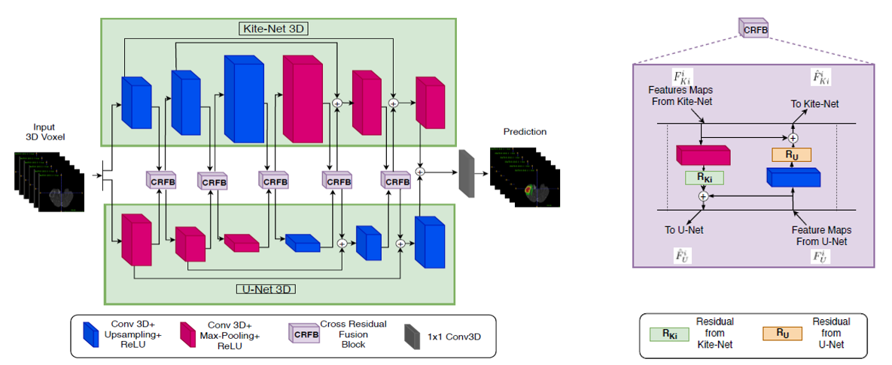

# Liver and tumor segmentation - KiU-Net

Adaptation and improvement of the existing neural network KiU-Net from the conference paper: [KiU-Net: Towards Accurate Segmentation of Biomedical Images using Over-complete Representations](https://arxiv.org/abs/2006.04878). The repository where we get the code can be found [here](https://github.com/jeya-maria-jose/KiU-Net-pytorch).

## Architecture overview

The "traditional" encoder-decoder networks such as U-Net architecture has been widely used for segmentation tasks, but it focuses more on high-level features rather than low-level features, which are important for detecting small structures like lesions. This can be problematic as the receptive field increases with depth in the decoder.

To address this issue, a KiU-Net 3D architecture with two branches is proposed. The first branch, called Kite-Net, is an overcomplete convolutional network that captures fine details and accurate edges of the input. The input image is projected into a higher dimension to constrain the receptive field from increasing in the deeper layers of the network. The second branch, U-Net, learns high-level features and projects the input image into a lower dimension, allowing the receptive field size of the filters to increase with depth, enabling it to extract high-level features in the deeper layers.

To combine the features of the two networks and further exploit their capacity, they introduce a novel cross residual feature block (CRFB) at each level in the encoder and decoder of KiU-Net 3D. This block combines the respective features at multiple scales to improve network performance.

Overall, KiU-Net 3D is a 3D convolutional architecture designed for volumetric segmentation tasks that addresses the challenges of detecting small structures in the image.

